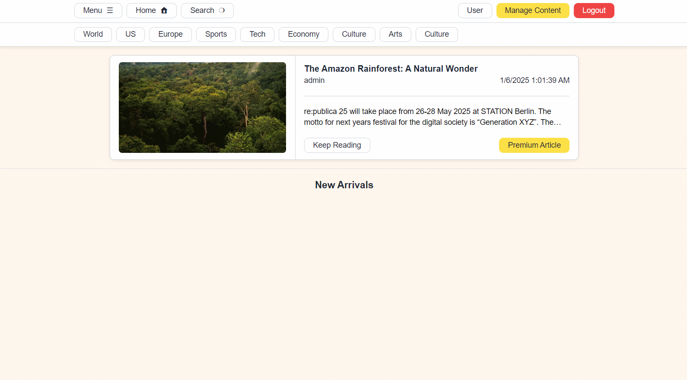

# MVC News - Modern .NET News Platform

## Table of Contents
- [Overview](#overview)
- [Key Features](#key-features)
- [Technical Stack](#technical-stack)
- [Architecture](#architecture)
- [Demo Videos](#demo-video)
- [Code Examples](#code-examples)
  - [Domain Models](#domain-models)
  - [Validators](#validators)
  - [Value Objects](#value-objects)
  - [Services](#services)
  - [Typescript Widgets](#typescript-widgets)
- [API Documentation](#api-documentation)
- [Engineering Challenges & Solutions](#engineering-challenges--solutions)
- [Setup Guide](#setup-guide)

## Overview
MVC News is a full-featured news platform built with .NET Core MVC, demonstrating clean architecture, domain driven design, cookie authentication and unit testing.

## Key Features
- User registration and authentication with role-based access control
- Article creation, editing, previewing, and deletion with rich text formatting
- Premium content management with subscription system
- Article search features
- Tag-based article categorization
- User profile management
- Admin dashboard for article management
- Custom markup parsing for article formatting

## Technical Stack
- Backend: .NET Core 8.0, ASP.NET MVC
- ORM: Entity Framework Core
- Architecture: CQRS with MediatR
- Validation: FluentValidation
- Frontend: TypeScript, Tailwind CSS
- Testing: xUnit, Moq

## Architecture
The application follows Clean Architecture principles with distinct layers:
- MVC (Presentation Layer)
- Application (Business Logic, Business Logic-Linked Validation)
- Domain (Business Rules)
- Infrastructure (Data Access)

## Demo Videos

### Login & Create Article


### Register & Subscribe


### Change Password


### Preview & Update


### Search By Tags & Title


## Code Examples

### Domain Models
Example of rich domain model with encapsulated business rules:

```csharp
public class Article
{
    public Article(Guid id, string title, string content, DateTime dateCreated, string headerImage, Guid authorId, List<string> tags, bool isPremium)
    {
        Id = id;
        Title = title;
        Content = content;
        DateCreated = dateCreated;
        HeaderImage = headerImage;
        AuthorId = authorId;
        Tags = tags;
        IsPremium = isPremium;
    }

    public Guid Id { get; private set; }
    public string Title { get; set; }
    public string Content { get; set; }
    public string HeaderImage { get; set; }
    public DateTime DateCreated { get; set; }
    public Guid AuthorId { get; set; }
    public List<string> Tags { get; set; }
    public bool IsPremium { get; set; }

    public bool CanBeUpdatedBy(User user) {
        if (user.Id == AuthorId) {
            return true;
        }

        if (user.IsAdmin) {
            return true;
        }

        return false;
    } 

    public bool CanBeAccessedBy(User user) {
        if (!IsPremium)
        {
            return true;
        }

        if (user.IsAdmin)
        {
            return true;
        }

        if (user.HasActiveSubscription())
        {
            return true;
        }

        return false;
    }

    
    public bool CanBeDeletedBy(User user) {
        if (user.IsAdmin)
        {
            return true;
        }

        return false;
    }
}
```

### Validators
Example of reusable validator implementation:

```csharp
public class UserWithIdExistsValidatorAsync : IValidatorAsync<Guid, User>
{
    private readonly IUserRepository _userRepository;

    public UserWithIdExistsValidatorAsync(IUserRepository userRepository)
    {
        _userRepository = userRepository;
    }

    public async Task<OneOf<User, List<ApplicationError>>> Validate(Guid input)
    {
        var user = await _userRepository.GetUserById(input);
        if (user is null)
        {
            return ApplicationErrorFactory.CreateSingleListError(
                message: $"User of id \"{input}\" does not exist.",
                code: ApplicationValidatorErrorCodes.USER_WITH_ID_EXISTS_ERROR,
                path: []
            );
        }
        return user;
    }
}
```

### Value Objects
Example of enforcing business rules through value objects:

```csharp
public class SubscriptionDates
{
    public SubscriptionDates(DateTime startDate, DateTime expirationDate)
    {
        var canCreateResult = CanCreate(startDate: startDate, expirationDate: expirationDate);
        if (canCreateResult.TryPickT1(out var error, out var _))
        {
            throw new Exception(error);
        }

        StartDate = startDate;
        ExpirationDate = expirationDate;
    }

    public DateTime StartDate { get; set; }
    public DateTime ExpirationDate { get; set; }

    public static OneOf<bool, string> CanCreate(DateTime startDate, DateTime expirationDate) {
        if (startDate > expirationDate)
        {
            return "Subscription start date cannot be smaller than expiration date";
        }

        return true;
    }
}
```

### Services
Example of service implementation with caching:

```csharp
public class DtoModelService : IDtoModelService
{
    private readonly Dictionary<Guid, User?> UserCache = new Dictionary<Guid, User?>();
    private readonly IUserRepository _userRepository;

    private async Task<User?> GetUserFromCacheOrDb(Guid id) 
    {
        if (UserCache.TryGetValue(id, out var cachedUser))
        {
            return cachedUser;
        } 
        var user = await _userRepository.GetUserById(id);
        UserCache[id] = user;
        return user;
    }

    public async Task<ArticleDTO> CreateArticleDTO(Article article)
    {
        var user = await GetUserFromCacheOrDb(article.AuthorId);
        var author = user is null ? 
            AuthorDTO.UNKOWN_AUTHOR : 
            new AuthorDTO(id: user.Id, displayName: user.DisplayName);
        
        return new ArticleDTO(
            id: article.Id, 
            title: article.Title, 
            content: article.Content, 
            headerImage: article.HeaderImage, 
            dateCreated: article.DateCreated, 
            author: author, 
            tags: article.Tags, 
            isPremium: article.IsPremium
        );
    }
}
```

### Typescript Widgets
Example of tags widget implementation for the frontend:
```typescript
declare global {
    var TagField: any;
}

const getElementOrThrow = <T extends Element>(el: HTMLElement, selector: string, errorMessage: string) => {
    const result = el.querySelector<T>(selector);
    if (result == null) {
        throw new Error(errorMessage);
    }

    return result;
};

global.TagField = class TagField {
    private _tags: Set<string>;
    private root: HTMLElement;
    private input: HTMLInputElement;
    private submitButton: HTMLButtonElement;
    private list: HTMLElement;
    private _tagFieldItemTemplate: HTMLElement;

    constructor(root: HTMLElement, initialTags: string[] = []) {
        this.root = root;
        this._tags = new Set(initialTags);  // Initialize with provided tags
        this.input = getElementOrThrow(root, '[role="TAG_FIELD_INPUT"]', "TagField input element does not exist.");
        this.submitButton = getElementOrThrow(root, '[role="TAG_FIELD_SUBMIT"]', "TagField submitButton element does not exist.");
        this._tagFieldItemTemplate = getElementOrThrow(root, '[data-template="TAG_FIELD_ITEM"]', "TagField item template does not exist.");
        this.list = getElementOrThrow(root, '[role="TAG_FIELD_LIST"]', "TagField list element does not exist.");

        this.setUp();

        // Initially render tags
        this.renderInitialTags();
    }

    private setUp() {
        // Add tag on button click
        this.submitButton.addEventListener("click", () => this.addItem());

        // Add tag on enter key press
        this.input.addEventListener("keydown", (event) => {
            event.stopPropagation();
            if (event.key === "Enter") {
                event.preventDefault();
                this.addItem();
            }
        });
    }

    private addItem() {
        const value = this.input.value.trim();
        if (value === "" || this._tags.has(value)) {
            return; // Avoid adding duplicate or empty tags
        }

        this._tags.add(value);
        this.input.value = "";

        // Add only the new item to the DOM
        this.addTagToDOM(value);
    }

    private removeItem(tag: string) {
        if (!this._tags.has(tag)) return;

        this._tags.delete(tag);

        // Remove the item from the DOM
        const node = this.list.querySelector(`[data-tag-value="${tag}"]`);
        if (node) {
            node.remove();
        }
    }

    private renderInitialTags() {
        this._tags.forEach((tag) => {
            this.addTagToDOM(tag);  // Render each initial tag
        });
    }

    private addTagToDOM(tag: string) {
        const node = this._tagFieldItemTemplate.cloneNode(true) as HTMLElement;
        node.innerHTML = node.innerHTML!.replace(/#value/g, tag);
        const input = getElementOrThrow(node, "input", "Input does not exist in tag item template");
        input.removeAttribute("disabled");
        node.classList.remove("hidden");

        // Set a unique identifier for easy DOM querying
        node.setAttribute("data-tag-value", tag);

        // Setup deletion handler
        node.addEventListener("click", () => this.removeItem(tag));

        this.list.appendChild(node);
    }
}

export {};
```


## API Documentation

### Articles API

#### Get Article
```http
GET /articles/{id}
```
- Requires authentication
- Returns article if user has access
- Redirects to subscription page for premium content without subscription

#### Create Article
```http
POST /articles/create
```
- Requires Admin role
- Request body:
```json
{
    "title": "string",
    "content": "string",
    "headerImage": "string",
    "tags": "string[]",
    "isPremium": "boolean"
}
```

#### Update Article
```http
POST /articles/{id}/update
```
- Requires Admin role or article ownership
- Same body as create

#### Search Articles
```http
GET /articles/search
```
Query parameters:
- `title`: string
- `authorId`: Guid
- `createdAfter`: DateTime
- `createdBefore`: DateTime
- `tags`: string[]
- `orderBy`: string
- `limitBy`: integer

## Engineering Challenges Encountered & Solutions

### Challenge 1: Repetitive Validation
**Problem**: I Frequently needed to validate entity existence in the application layer.

**Solution**: Created reusable validators:
- Implemented `IValidatorAsync` interface
- Created specialized validators like `UserWithIdExistsValidatorAsync`
- Validators return `OneOf<T, List<ApplicationError>>` for type-safe error handling
- Each Validator has a corresponding unique error code that the presentation layer uses to handle application layer errors
- Reduced code duplication and standardized validation logic

### Challenge 2: Complex Business Rules
**Problem**: Business Rules for Subscription dates were scatters as validation logic in the application layer

**Solution**: Value Objects and Rich Domain Models:
- Created `SubscriptionDates` value object to encapsulate date validation
- Implemented business rules in domain entities (e.g., `Article.CanBeAccessedBy`)
- Used static factory methods for validated object creation

### Challenge 3: Performance Optimization
**Problem**: Frequent user lookups causing unnecessary database calls when looking up Article authors.

**Solution**: Implemented caching in `DtoModelService`:
- In-memory cache for user data
- Cache-first approach with database fallback
- Reduced database load for common operations

## Setup Guide
```
Go to the "MVC_News.MVC" folder and make a .env file based off of ".env_pattern" with your own database access data
```

## Getting Started
1. Clone the repository:
```
git clone https://github.com/m-7ard/Dotnet-MVC-News-Service.git
```
```
>> dotnet restore
>> cd MVC_News.MVC
>> dotnet watch run
```
```
(in another console)
>> cd MVC_News.MVC/wwwroot
>> npm i
>> npm run dev
```
